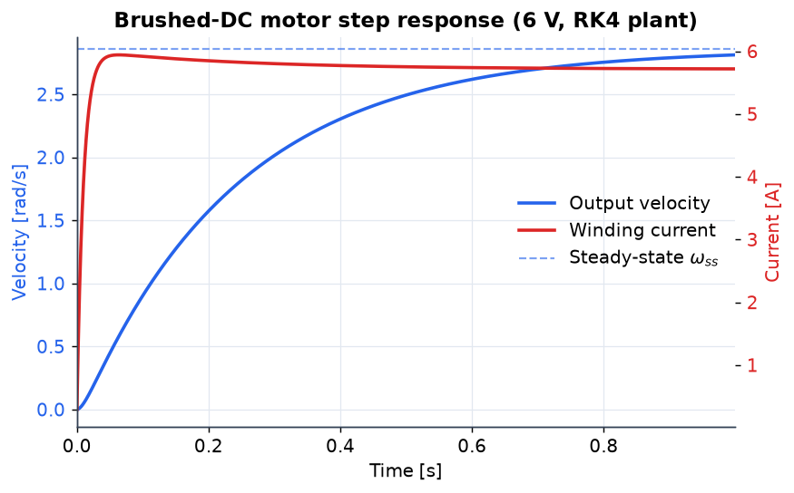
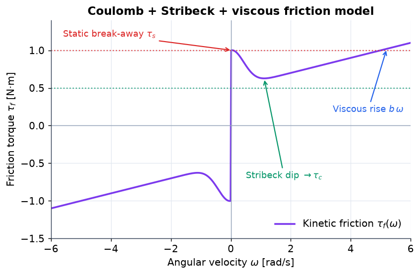
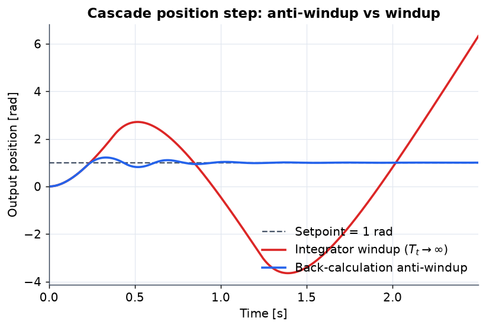
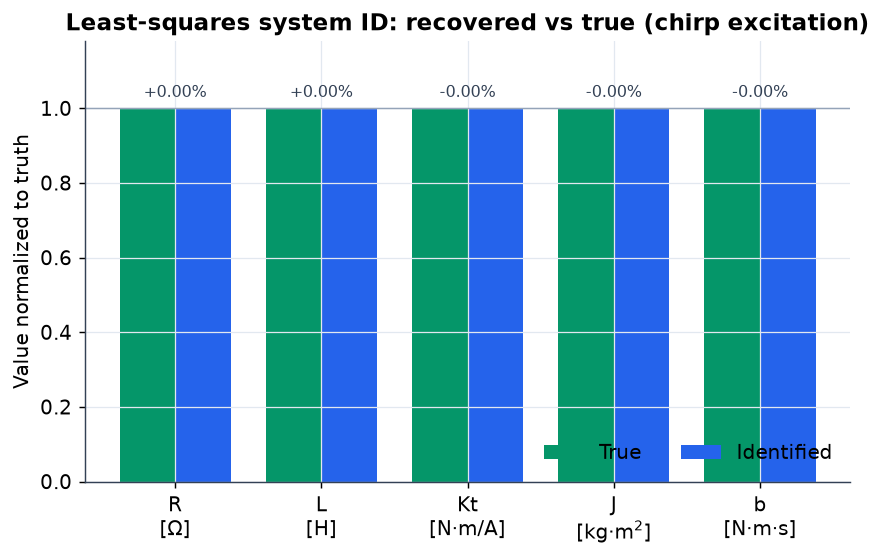
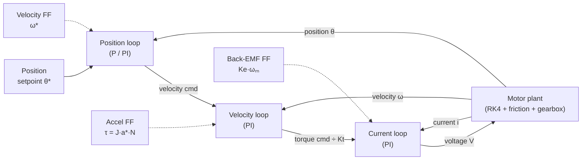

# Robot Test Bench

A comprehensive testing framework for robotic systems, providing tools for motor control simulation, sensor emulation, data acquisition, and real-time visualization.

## Visualizations

Every figure below is generated directly from the simulation API by
[`scripts/make_figures.py`](scripts/make_figures.py) (`.venv/bin/python scripts/make_figures.py`) —
no hand-drawn data. They exercise the same code paths covered by the test suite.

### Brushed-DC motor plant



A 6 V voltage step into the `MotorSimulator`. The winding current spikes on the fast electrical time constant (L/R) while output velocity rises on the slower mechanical pole toward the closed-form steady state — the signature of the coupled second-order electromechanical plant.



The drivetrain friction model swept over ±ω: static break-away at `τ_s`, the Stribeck dip decaying toward Coulomb `τ_c`, and the linear viscous rise `b·ω` at speed.

### Cascade servo control



A 1 rad position step through the three-loop `CascadeController`. With back-calculation anti-windup the response settles cleanly on target; disabling it (tracking time constant → ∞) lets the integrator wind up and the axis overshoots and oscillates badly.

### System identification



A chirp-excitation run fed through least-squares `identify_motor_parameters` recovers all five plant parameters (R, L, Kt, J, b) to ~0.00 % error against the ground-truth values that generated the data.

## Flexible-joint resonance & input shaping

A real servo axis is never a single rigid inertia: the rotor and the driven load are coupled through a **compliant transmission** (belt, harmonic drive, long shaft), which turns the plant into a **two-mass resonant system** — the classic source of "singing" axes, limit-cycle chatter, and the hard ceiling on closed-loop bandwidth. [`robot_testbench/resonance.py`](robot_testbench/resonance.py) models that plant and demonstrates **input shaping** as a model-based way to command a move that does not excite the resonance.

With motor angle `θm` and load angle `θl`, shaft stiffness `k` and internal damping `c`:

```
Jm · θm'' = τ − k(θm − θl) − c(θm' − θl')
Jl · θl'' =     k(θm − θl) + c(θm' − θl')
```

The plant has two characteristic frequencies, recovered in closed form by `resonance_modes()`:

| Quantity | Formula | Meaning |
|---|---|---|
| Resonance | `ω_res = √(k(Jm+Jl) / (Jm·Jl))` | resonant pole — sharp peak in the **load** FRF `τ→θl` |
| Anti-resonance | `ω_anti = √(k / Jl)` | zero of the **collocated** (motor-side) FRF `τ→θm`; the load acts as a tuned absorber |
| Damping ratio | `ζ = c(Jm+Jl) / (2·√(k(Jm+Jl)·Jm·Jl))` | damping of the resonant pair |

**Input shaping** (`apply_input_shaper`) convolves the reference command with a short impulse train timed so the individual residual vibrations cancel at `ω_res` — a zero-phase, model-based notch placed exactly on the resonance:

- **ZV** (Zero-Vibration), two impulses: `A1 = 1/(1+K)` at `t=0`, `A2 = K/(1+K)` at `t = T_d/2`, where `K = exp(−ζπ/√(1−ζ²))`, `T_d = 2π/ω_d`, `ω_d = ω_res·√(1−ζ²)`.
- **ZVD** (Zero-Vibration-and-Derivative), three impulses at `0, T_d/2, T_d` with weights `[1, 2K, K²]/(1+2K+K²)` — far more robust to a mis-estimated resonance.


**Left:** the dynamic-compliance FRF (normalised by the rigid-body `1/s²` baseline) — the load response (blue) peaks at `ω_res`, while the collocated motor response (green) drops into a deep anti-resonance notch at `ω_anti`. **Right:** a rest-to-rest bang-bang move drives the load to a new angle; the unshaped command leaves the load ringing on the resonance, while the ZV-shaped command arrives at the **same** final angle with the residual vibration cut by ~99 %.

### Sensor emulation

The bench also models realistic sensor behaviour (quantization, noise, bias, saturation):


## Control architecture

The servo loop is a classic three-loop cascade (outer position → middle velocity → inner current → motor plant), each loop a PI block with back-calculation anti-windup and physically-motivated feedforward. This mirrors [`robot_testbench/control/cascade.py`](robot_testbench/control/cascade.py):



Solid arrows are the forward command path; dotted arrows are feedforward injections; the bottom arrows are the three feedback measurements (current, velocity, position) closing each loop.

## Quick Start

### 1. Installation

```bash
# Clone the repository
git clone https://github.com/yourusername/robot_testbench.git
cd robot_testbench

# Create and activate virtual environment
python -m venv venv
source venv/bin/activate  # Linux/Mac
# or
venv\Scripts\activate     # Windows

# Install the package in development mode
pip install -e .
```

### 2. Run Tests

```bash
# Run all tests
pytest

# Run with verbose output
pytest -v

# Run specific test types
python tests/run_tests.py --type unit
python tests/run_tests.py --type integration

# Run with coverage
pytest --cov=robot_testbench --cov-report=term-missing
```

### 3. Generate Sample Data

```bash
# Create sample test data for the dashboard
python -m robot_testbench.create_sample_data
python -m robot_testbench.create_harmonic_drive_data
```

### 4. Run Dashboard

```bash
# Start the main dashboard (opens in browser at http://localhost:8050)
python -m robot_testbench.run_test_dashboard

# Run on different port
python -m robot_testbench.run_test_dashboard --port 8080

# Run in debug mode
python -m robot_testbench.run_test_dashboard --debug
```

### 5. Run Examples

```bash
# Simple dashboard example
python examples/simple_dashboard.py

# Sensor demonstration
python examples/sensor_demo.py

# Electrical simulation
python examples/electrical_sim_example.py
```

## What You Get

### 🧪 **Testing Framework**
- **Unit Tests**: Individual component testing (motors, sensors, controllers)
- **Integration Tests**: System-level testing with multiple components
- **Performance Tests**: Benchmarking and performance analysis
- **Test Protocols**: YAML-based test configurations

### 📊 **Dashboard & Visualization**
- **Real-time Dashboard**: Web-based interface at `http://localhost:8050`
- **Test Results**: View and analyze test data with SPC overlays
- **Motor Simulations**: Real-time motor control visualization
- **Sensor Data**: Encoder, force/torque, and joint angle sensor readings

### 🔧 **Core Components**
- **Motor Simulation**: Realistic motor models with electrical and mechanical dynamics
- **Sensor Emulation**: Encoder, force/torque, and joint angle sensor simulation
- **Control Systems**: PID controllers with anti-windup and feedforward
- **Data Acquisition**: High-speed data logging and signal processing

## Project Structure

```
RobotTestBench/
├── robot_testbench/          # Main package
│   ├── motor/               # Motor simulation
│   ├── sensors/             # Sensor emulation
│   ├── control/             # Control systems
│   ├── dashboard/           # Visualization
│   └── visualization/       # Plot utilities
├── examples/                # Example scripts
├── tests/                   # Test suite
├── data/logs/               # Test data storage
└── reports/                 # Test results
```

## Common Commands

### Testing
```bash
pytest                    # Run all tests
pytest -v                 # Verbose output
pytest --benchmark-only   # Performance benchmarks
python tests/run_tests.py --coverage --html  # Coverage report
```

### Dashboard
```bash
python -m robot_testbench.run_test_dashboard     # Main dashboard
python examples/simple_dashboard.py              # Simple example
python examples/sensor_demo.py                   # Sensor demo
```

### Data Generation
```bash
python -m robot_testbench.create_sample_data     # Basic test data
python -m robot_testbench.create_harmonic_drive_data  # Advanced test data
```

## Troubleshooting

### Import Errors
If you get `ModuleNotFoundError: No module named 'robot_testbench'`:
```bash
pip install -e .  # Install in development mode
```

### Missing Dependencies
If you get missing module errors:
```bash
pip install -r requirements.txt  # Install all dependencies
```

### Dashboard Not Loading
Make sure you have sample data:
```bash
python -m robot_testbench.create_sample_data
python -m robot_testbench.run_test_dashboard
```

## Development

```bash
# Install development dependencies
pip install -e ".[dev]"

# Run linting
black .
isort .
pylint robot_testbench
```

## License

This project is licensed under the MIT License - see the [LICENSE](LICENSE) file for details.
